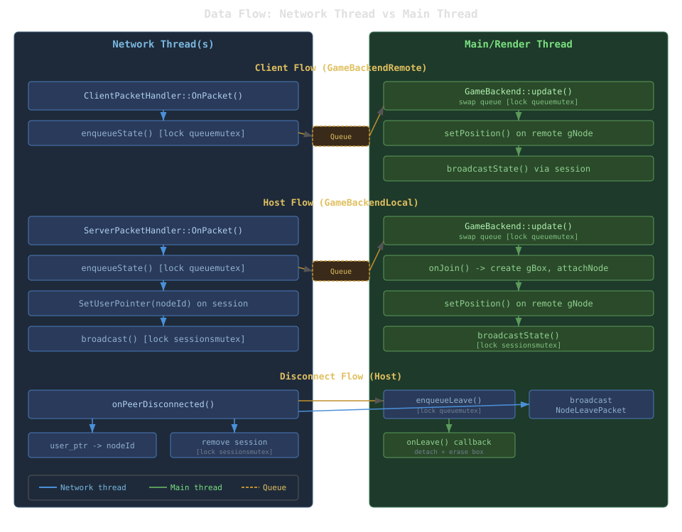

# Threading Model

This example uses the **main thread** (GlistEngine's render loop), znet's network workers, miniaudio's device callback, and the team-voice codec/mixer worker. Understanding which code runs where is key to avoiding races.

## Execution Contexts

### Main Thread (Render Loop)
GlistEngine calls `update()` and `draw()` on the main thread every frame. All game logic, rendering, and node manipulation happens here.

Runs:
- `GameCanvas::update()` — moves the local player, calls `backend->update()`
- `GameCanvas::draw()` — renders all boxes
- `GameBackend::update()` — drains the event queue, applies positions to remote nodes, sends local node positions
- `gTeamVoice::updateNetwork()` — drains encoded uplinks into the active ZDT session

### Network Thread(s) (znet)
znet runs a pool of background threads for network I/O, distributing sessions across them. When a packet arrives or a connection event happens, znet calls our handlers on one of these threads, **not the main thread**. This means two `ServerPacketHandler::OnPacket()` calls for different clients can run concurrently on different threads — which is why the locks protect shared state like the sessions list and event queue.

Runs:
- `ServerPacketHandler::OnPacket()` — when a client sends data to the host
- `ClientPacketHandler::OnPacket()` — when the server sends data to a client
- `GameBackendLocal::onPeerConnected/Disconnected()` — when a client connects/disconnects
- `GameBackendRemote::onConnected/Disconnected()` — when we connect to/disconnect from a server
- Voice packet handlers — forward controls/downlinks to `gTeamVoice` and uplinks to `gTeamVoiceServer`
- Connection workers — perform the potentially blocking ZDT client handshake; backend destructors join them before `Disconnect()` and `Wait()`

## Why We Need Locks

The problem: the network thread writes data that the main thread reads. Without synchronization, both threads could access the same data at the same time, causing crashes or corrupted state.

### queuemutex (in GameBackend)

Protects the event queue (`std::vector<QueuedEvent>`).

- **Network thread writes:** `enqueueState()` and `enqueueLeave()` push events onto the queue when packets arrive.
- **Main thread reads:** `update()` swaps the entire queue into a local variable, then processes it.

The swap pattern (`batch.swap(queue)`) is important — it holds the lock for just the swap, not for the entire processing loop. This keeps the lock duration minimal so the network thread isn't blocked.

```
Network thread:                    Main thread:
enqueueState() {                   update() {
  lock(queuemutex)                   lock(queuemutex)
  queue.push_back(...)               batch.swap(queue)  // instant
  unlock                             unlock
}                                    // process batch without holding lock
                                   }
```

### sessionsmutex (in GameBackendLocal)

Protects the sessions list (`std::vector<shared_ptr<PeerSession>>`).

- **Network thread writes:** `onPeerConnected()` adds sessions, `onPeerDisconnected()` removes them.
- **Main thread reads (indirectly):** `broadcastState()` iterates the list to send packets, called from `update()`.
- **Network thread also reads:** `broadcast()` in `ServerPacketHandler::OnPacket()` iterates the list to forward packets to other clients.

Multiple threads can be reading and writing the sessions list simultaneously, so every access is guarded.

### Voice session locks

`GameBackendRemote::sessionmutex` and `GameBackendLocal::localvoicesessionmutex` protect the `shared_ptr<PeerSession>` values written by znet callbacks and read by the main-thread voice pump. Each main-thread use takes a shared-pointer snapshot and releases the lock before sending.

`gTeamVoice` uses bounded queues between the miniaudio callback, the main/network threads and its codec worker. Session, mute, disable and PTT transitions are media barriers; the device callback does not encode, decode or lock network state.

`gTeamVoiceServer` owns authoritative connection-to-player/team state. In this demo every ready connection is assigned to team `1` by the server. Voice packets never provide their own sender or team identity.

## What Doesn't Need Locks

- `localbox`, `remoteboxes`, key state — only accessed on the main thread (in `update()` and `draw()`).
- `GameBackend::nodes` map — only accessed in `update()` which runs on the main thread. `attachNode/detachNode` are also called from the main thread (in `setup()` and callbacks within `update()`).
- Key state and PTT state are changed on the main thread. Releasing `V`, hiding the canvas or returning to the menu stops transmission; receiving remains active without a key press.

## Data Flow Diagram


